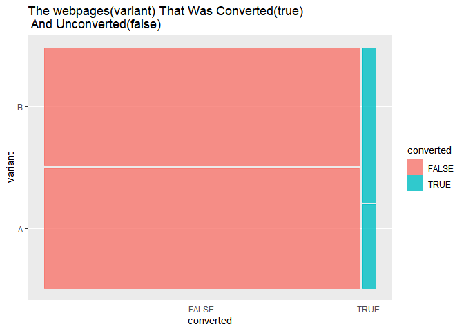
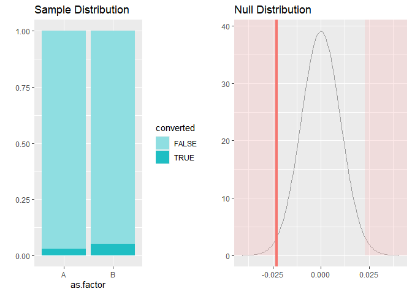
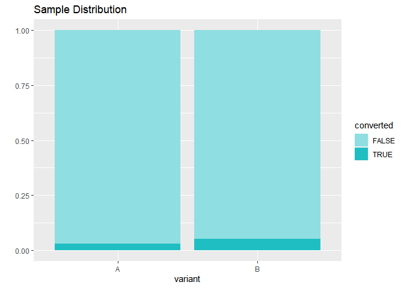

A/B test
================
ELegushi Adetunji
12/23/2021

Wayne E-commerce store has been using a particular type of webpage for
more than two years now and is considering if there is a need to change
the current webpage or to stick to the current one.

So as not to take the wrong decision, they reached out to their data
analyst in order to use data to make their decision whether to change
the current webpage or to stick to the current one.

As the data analyst, you are told to carry out an A\|B test, so that the
organisation will be sure that they are not taking the wrong decision.

After weeks of planning and carrying out a randomized sample for two
weeks and after getting the required sample size, the data analyt set
out to work.

Let us get familiar with what an A\|B test is first and how the data was
collected.

An A/B test is a randomized controlled experiment (assuming it meets the
conditions of controlled factors and randomized users).

**Randomized**

Randomization is mainly involved in the equation to remove hidden bias
from an experiment. It gives us the ability to say that our results were
actually caused by a certain improvement or change in the current way of
doing things (in the context of A/B testing).

**Controlled**

It is controlled because we have a control group and a treatment group,
where the control group is assigned the current way of things, and the
treatment group is assigned the new way of things. This allows us to
compare our results with something; in other words, the control group is
our baseline.

To put this all together, in the context of a web page design, users
will be randomly sampled and randomly assigned treatment by splitting
into the control and the treatment groups. The control group would see
the original version of the page, and the treatment group will see the
new design.

for this project, there will be three sections, which includes:

Explanatory analysis

statistical analysis

Then give recommendation

loading the data

``` r
load("~/Ab test/A/B TEST/A/ABTest.rda")
ABTest->df
```

A quicK look at the data.

``` r
glimpse(df)
```

    ## Rows: 1,451
    ## Columns: 4
    ## $ variant        <fct> A, A, A, A, A, A, A, A, A, A, A, A, A, A, A, A, A, A, A~
    ## $ converted      <lgl> FALSE, FALSE, FALSE, FALSE, FALSE, FALSE, FALSE, FALSE,~
    ## $ length_of_stay <int> 0, 0, 0, 0, 0, 0, 0, 0, 0, 0, 0, 1, 0, 0, 0, 2, 0, 0, 0~
    ## $ revenue        <dbl> 0.00, 0.00, 0.00, 0.00, 0.00, 0.00, 0.00, 0.00, 0.00, 0~

Variant is the website version that was seen by the visitor and it is a
categorical data, having two variants, variant A and B. variant a is the
old wbpage, while B is the new webpage.

Converted column means if the the customer purchased the product or not
with,with false meaning the customer did not and vice versa.

length of stay refers to how many minute the customer stayed on the
webpage.

Revenue is the amount generated from each visit.

------------------------------------------------------------------------

### Now we will be checking the what about the data and get insight from them.

``` r
set_flextable_defaults(
  font.size = 10, theme_fun = theme_vanilla,
  padding = 6,
  font.family = "sans",
  background.color = "#EFEFEF",
  font.color = "black")
 
df %>% 
  group_by(variant) %>% 
  count(converted,name = "count") %>% 
  adorn_totals() %>% 
  flextable()->tt
theme_vanilla(tt) ->tt
set_caption(tt,"From the table, we have more of unconverted(false) webpage than the counterpart")->tt
bold(tt)->tt
color(tt,~converted == "FALSE",color = "red")->tt
add_footer_lines(tt,"Count of both variants of the webpages that was converted and viceversa")
```

#### Let us go ahead and check it visually

``` r
library(ggmosaic)
ggplot(df)+geom_mosaic(aes(x=product(variant,converted),fill=converted))+
  labs(title = "The webpages(variant) That Was Converted(true)\n And Unconverted(false)")
```

<!-- -->

#### length of stay

``` r
df %>% 
  group_by(variant) %>% 
  summarise(length=sum(length_of_stay)) %>% flextable()->yy
add_footer_lines(yy,"Total length of stay on each website")->yy
set_caption(yy,"Variant B Has The Highest Stay Time ")->yy
color(yy,~length >113,color = "blue")
```

## **statistical analysis.**

#### checking the conversion rate

``` r
df %>% 
  count(variant,name =" visits")->visitors
visitors %>% 
  flextable()->nn
set_caption(nn,caption = "Total Visitors That Visited The site",style = "table caption", autonum = TRUE)
```

#### Conversions

``` r
df %>% 
  filter(converted=="TRUE" & variant =="A") %>% 
  count()
```

    ##    n
    ## 1 20

#### Conversion rate for A

``` r
20/721
```

    ## [1] 0.02773925

#### Conversion for B

``` r
df %>% 
  filter(converted=="TRUE" & variant =="B") %>% 
  count()
```

    ##    n
    ## 1 37

#### Conversion rate for B

``` r
37/730
```

    ## [1] 0.05068493

#### from the conversion rate, we can see that variant B has a higher conversion rate than A and should be able to decide a winner

#### Checking if there is a difference between conversion rate in order to decide a winner between both variants

**Testing of hypothesis**

Ho = Variant A = B, no difference between the two variants.

HA = Variant A != B, there is a difference between the two variants.

**NOTE**

If our p\_value is less than 0.05 we reject the null hypothesis, if its
is higher we accept the null hypothesis and reject the alternnate
hypothesis.

``` r
inference(y=converted,x=as.factor(variant),data=df,statistic = "proportion",type = "ht",null = 0,method = "theoretical",alternative = "twosided",success = "TRUE")
```

    ## Response variable: categorical (2 levels, success: TRUE)
    ## Explanatory variable: categorical (2 levels) 
    ## n_A = 721, p_hat_A = 0.0277
    ## n_B = 730, p_hat_B = 0.0507
    ## H0: p_A =  p_B
    ## HA: p_A != p_B
    ## z = -2.2495
    ## p_value = 0.0245

<!-- -->

From above, the p\_value is lower than 0.05, so we reject the null
hypothesis.

This means that there is a statistical difference in the conversion rate
for the two variants and it is not due to chance.

#### To compute our confidence interval

``` r
inference(y=converted,x=variant, data = df,type = "ci",method = "theoretical",statistic = "proportion",success = "TRUE")
```

    ## Response variable: categorical (2 levels, success: TRUE)
    ## Explanatory variable: categorical (2 levels) 
    ## n_A = 721, p_hat_A = 0.0277
    ## n_B = 730, p_hat_B = 0.0507
    ## 95% CI (A - B): (-0.0429 , -0.003)

<!-- -->

from above, we can say that we are 95% confident that the conversion
rate for variant a is as low as 0.429 and variant b is low by 0.3, and
this result agrees with our hypothesis test.

**Observations**

-   The new webpage amassed more visitors and more conversion rate than
    the old webpage.

-   Both webpage had a total visitors of 1451.

-   We had more unconverted(1394) visits than converted visits(57) for
    both webpage or variants

-   Length of stay for B(125) is higher than the length of stay for
    A(113).

-   After carrying out hypothesis test, the result showed that the
    difference between the conversion rate are not due to mere chances
    and are statistically different.

-   WE are 95% confident that conversion rate for A is lower than the
    conversion rate of B.

**Recommendation**

The organisation can go ahead and change the webpage to the new one,as
this will bring in more customers for the organisation and will result
in more revenue.
